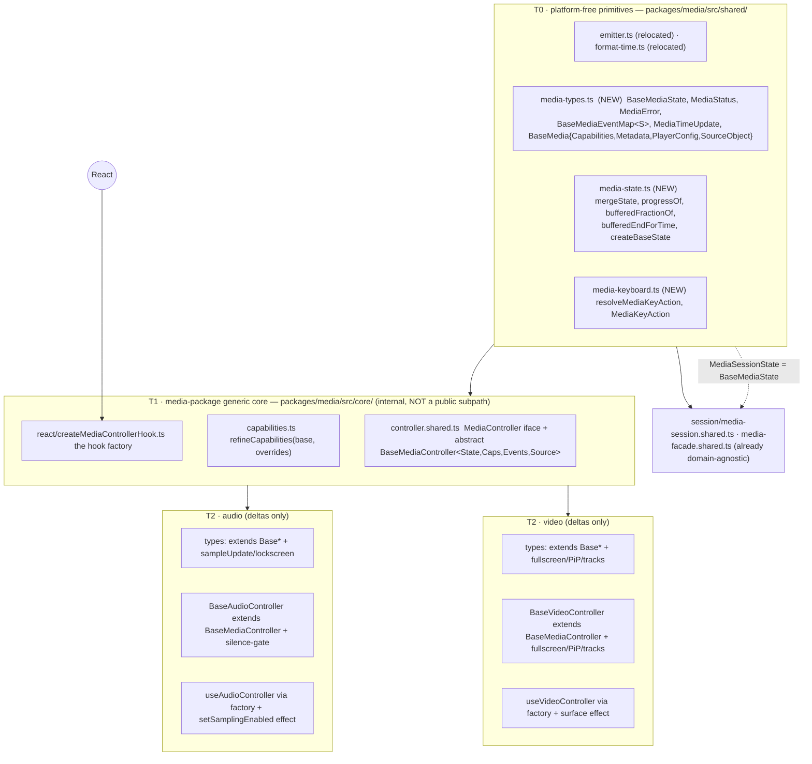

# Harden & re-architect `@knitui/media` (audio + video)

## Context

`@knitui/media` is the hybrid audio+video kit (web `HTMLMediaElement`/Web-Audio + expo
backends behind one provider-agnostic controller contract per domain). It is structurally
healthy — not a bug hunt, a **consistency + organization + hardening** pass.

The audio and video domains are ~70% structurally identical but have **drifted**: two status
types, two error types, two near-identical event maps, byte-identical pure state helpers,
near-identical controller base classes and React hooks, and a unified `updateInterval` vs
`timeUpdateInterval` / `artworkUrl` vs `artwork` / differing `timeUpdate` payloads. There is
**one real behavioral bug**: native video's `seekBy` override bypasses the base's clamp +
optimistic state update.

Intended outcome: a **generic media core** both domains specialize, so common contracts live
in one place and drift becomes impossible by construction. The unification is already proven
in-package — `session/media-session.shared.ts` (`MediaSession<C,S,Src>`) and
`media-facade.shared.ts` (`MediaFacadeBase`) are fully domain-agnostic and shared by both
domains. This plan hoists the duplicated *middle* layers (state helpers, base types, keyboard,
controller base, hook factory) up to that same altitude. Tamagui chrome stays per-domain
(deliberately out of scope — a generic `styled()` layer hits this kit's known inference pain).

### ⚠️⚠️ FINDING THAT CHANGES THE DRAFT — re-home the T0 tier (verify before starting)

The draft placed all platform-free primitives in `@knitui/core/src/media/`. **That directory is
being deleted right now** by the concurrent refactor (working tree shows `core/src/media/{emitter,format-time,index}.ts`
deleted and the `media` export removed from `core/src/index.ts`). The primitives `TypedEmitter`,
`Listener`, and `formatTime` are being relocated into a **new `packages/media/src/shared`**
module — the engine barrels (`audio/engine/index.ts`, `video/engine/index.ts`, `audio/engine/format-time.ts`)
already import `from "../../shared"`, **but that module does not exist yet, so the tree currently
does not typecheck.** (`smoothing` did *not* move into media — it stays at `@knitui/core/src/config/smoothing.ts`.)

Consequences folded into this plan:
- **T0 lives in `packages/media/src/shared/`, NOT `@knitui/core`.** No cross-package hoist; no new
  `@knitui/core` exports; `@knitui/core` is not touched at all. This is *simpler* than the draft.
- Drop every `@knitui/core` verification step and all "core gains real exports" framing.

### ⚠️ Sequencing gate (do NOT start until ALL true)
A concurrent agent is (a) removing audio visualization to `@knitui/graphics` and (b) relocating
media primitives to `packages/media/src/shared`. Both are mid-flight/uncommitted. **Before
implementing, re-verify the working tree:**
1. `packages/media/src/shared` exists and exports `TypedEmitter`, `Listener`, `formatTime`.
2. `pnpm --filter @knitui/media typecheck` is **clean** (it is currently broken — missing `shared`).
3. The visualization files are gone/committed (`visualizers/`, `surface/AudioVisualizer*`,
   `surface/AudioSpectrogram*`, `engine/fft`, `engine/waveform`, `useAudioSamples`).

This plan never touches visualization files; `emitSample`/`sampleUpdate`/`AudioSampleData` stay
in the audio domain untouched. But it edits `audio/types.ts`, both engine barrels, and `src/shared`,
which would collide if run concurrently.

**Chosen approach (user-selected):** Full generic core + Focused test coverage.

---

## Target architecture — three tiers



Tier rule = what each may import: **T0** nothing platform/React · **T1** T0 + React (in `react/` only) ·
**T2** T0, T1, platform SDKs. Public surface (`@knitui/media/audio`, `@knitui/media/video`) is **unchanged**;
root `index.ts` stays `export {}`; `src/core/` and `src/shared/` are internal (no new lib entry point).

---

## Generic core sketches (verified against current code)

**T0 `src/shared/media-types.ts`** — the 12 common state fields in exactly one place:
```ts
export type MediaStatus = "idle" | "loading" | "readyToPlay" | "error";
export interface MediaError { message: string; code?: string | number }
export interface MediaTimeUpdate { currentTime: number; duration: number; bufferedPosition: number }
export interface BaseMediaState {
  status: MediaStatus; playing: boolean; currentTime: number; duration: number;
  bufferedPosition: number; volume: number; muted: boolean; playbackRate: number;
  loop: boolean; isLive: boolean; ended: boolean; error: MediaError | null;
}
export type MediaSessionState = BaseMediaState;   // widens the session's 10-field bound (both states satisfy it)
export interface BaseMediaCapabilities { canSetVolume: boolean; canSetPlaybackRate: boolean }
export interface BaseMediaEventMap<State extends BaseMediaState> {
  change: State; statusChange: { status: MediaStatus; error: MediaError | null };
  playingChange: { playing: boolean }; timeUpdate: MediaTimeUpdate;
  volumeChange: { volume: number; muted: boolean }; playbackRateChange: { playbackRate: number };
  durationChange: { duration: number }; sourceLoad: { duration: number };
  playToEnd: void; error: MediaError;
}
export interface BaseMediaSourceObject { uri?: string; assetId?: number; headers?: Record<string,string> }
export interface BaseMediaPlayerConfig {
  autoPlay?: boolean; loop?: boolean; muted?: boolean; volume?: number;
  playbackRate?: number; updateInterval?: number;   // unified name (video's timeUpdateInterval folds in)
}
export interface BaseMediaMetadata { title?: string; artist?: string; artwork?: string }
```

**Domain `types.ts` collapse** (`extends` keeps nominal names in errors/tooltips):
```ts
// audio/types.ts
export interface AudioControllerState extends BaseMediaState {
  shouldCorrectPitch: boolean; isBuffering: boolean; isLoaded: boolean;
  lockScreenActive: boolean; metadata: AudioMetadata | null;
}
export interface AudioControllerEventMap extends BaseMediaEventMap<AudioControllerState> { sampleUpdate: AudioSampleData }
export interface AudioCapabilities extends BaseMediaCapabilities { canCorrectPitch: boolean; canSample: boolean; canLockScreen: boolean }
export interface AudioMetadata extends BaseMediaMetadata { albumTitle?: string }
// video/types.ts
export interface VideoControllerState extends BaseMediaState {
  fullscreen: boolean; pictureInPicture: boolean;
  availableAudioTracks: AudioTrack[]; availableSubtitleTracks: SubtitleTrack[]; availableVideoTracks: VideoTrack[];
  audioTrackId: string | null; subtitleTrackId: string | null; activeCueText: string | null;
}
export interface VideoControllerEventMap extends BaseMediaEventMap<VideoControllerState> {
  fullscreenChange: { fullscreen: boolean }; pictureInPictureChange: { pictureInPicture: boolean };
  tracksChange: { availableAudioTracks: AudioTrack[]; availableSubtitleTracks: SubtitleTrack[]; availableVideoTracks: VideoTrack[] };
}
export interface VideoCapabilities extends BaseMediaCapabilities { canFullscreen; canPictureInPicture; canSelectAudioTracks; canSelectSubtitleTracks; canAirPlay; canGenerateThumbnails }
```

**T1 `src/core/controller.shared.ts`** — generic base, shrinks each domain base to its deltas. The
current `BaseVideoController` (182 ln) and `BaseAudioController` (205 ln) become thin subclasses:
```ts
export interface MediaController<State extends BaseMediaState, Caps, Events extends BaseMediaEventMap<State>, Source> {
  readonly state: State; readonly capabilities: Caps;
  subscribe(l: (s: State) => void): () => void;
  on<K extends keyof Events>(t: K, l: (p: Events[K]) => void): () => void;
  play(): void; pause(): void; togglePlay(): void; replay(): void;
  seekTo(s: number): void | Promise<void>; seekBy(s: number): void | Promise<void>;   // widened (video was void-only)
  setVolume(v: number): void; setMuted(m: boolean): void; toggleMuted(): void;
  setPlaybackRate(rate: number, pitchCorrection?: unknown): void; setLoop(l: boolean): void;
  replace(src: Source): void | Promise<void>; retry(): void | Promise<void>; dispose(): void;
}
abstract class BaseMediaController<State, Caps, Events, Source> implements MediaController<...> {
  protected readonly emitter = new TypedEmitter<Events>();   // from "../shared"
  protected _state: State;
  protected constructor(makeInitial: (init?: Partial<State>) => State, initial?: Partial<State>) { this._state = makeInitial(initial); }
  // shared bodies hoisted verbatim from the two existing bases:
  //   get state · subscribe · on · setState(mergeState+emit "change") · emitEvent · togglePlay · toggleMuted · seekBy(→seekTo) · dispose
  // abstract: play pause replay seekTo setVolume setMuted setPlaybackRate setLoop replace retry
}
```
- `BaseAudioController extends BaseMediaController<...>` adds ONLY the silence-gate
  (`emitSample`, `SAMPLE_SILENCE_FLOOR`, `_lastAudibleSampleMs`) + lock-screen/sampling abstracts.
- `BaseVideoController extends BaseMediaController<...>` adds ONLY `toggleFullscreen`/`togglePictureInPicture`
  (with the existing reject-swallow `try/catch`) + tracks/presentation abstracts.
- **The one type seam** — `TypedEmitter<Events>` keyed by the fixed literal `"change"` — lives entirely
  in the base (≤2 `as` casts, never leaks to subclasses). **Fallback if the generic-key fight gets
  ugly:** type the internal emitter `TypedEmitter<any>` at exactly that boundary; still removes the dup.

**T1 `src/core/react/createMediaControllerHook.ts`** — confirmed: `useAudioController.tsx` and
`useVideoController.tsx` are byte-identical except the engine hook (`useAudioEngine`/`useVideoEngine`),
the `configBag`, and one extra effect. Factory signature:
```ts
createMediaControllerHook({ useEngine, configBag, getSource, extraEffects })
//   wiring (identical): useId → idempotent register → useMemo(getFacade) →
//   useSyncExternalStore(session.subscribe, () => session.snapshotFor(id)) →
//   source-sync effect w/ skip-first ref → loop/muted/volume/rate effects → autoplay → unregister cleanup
```
- audio `extraEffects`: `facade.setSamplingEnabled(Boolean(options.sampling))`.
- video `extraEffects`: `engine.session.update(id, { config: { surface: options.surface } })`.
Each domain hook (`.tsx` + `.native.tsx`) becomes ~15 lines. Pure TS/React — no Tamagui.

**Keyboard:** `resolveMediaKeyAction` (T0 `src/shared/media-keyboard.ts`) returns the common action union;
`audio/engine/keyboard.ts` re-exports it (audio has no extra keys); `video/engine/keyboard.ts` wraps it
and adds `f`/`F`→toggleFullscreen, `p`/`P`→togglePictureInPicture (`VideoKeyAction = MediaKeyAction | those`).
Barrels currently export `resolveKeyAction` + `AudioKeyAction`/`VideoKeyAction` — keep those names.
**Capabilities:** keep per-domain `WEB`/`NATIVE` consts (genuinely different data); rewrite
`resolveWebCapabilities` as a one-liner over `refineCapabilities(base, overrides)`.

---

## API-consistency fixes & the bug (folded into the phases below)

All renames ship as additive `@deprecated` aliases first, so public API + existing chrome compile at
every step; breaking removal is a later, separate major.

| Drift | Canonical | Mechanism |
|---|---|---|
| Status type | `MediaStatus` | `AudioStatus`/`VideoStatus` alias it; `AudioPlaybackStatus` → `@deprecated` alias of `AudioStatus` |
| Error type | `MediaError` | `AudioError`/`VideoError` alias it. **DOM name clash:** web adapters already use `MediaError` (DOM) — alias-import the package type inside web adapters |
| Config interval | `updateInterval` | drop video's `timeUpdateInterval`; update `video/hooks/useVideoController.shared.ts:62 pickPlayerConfig` + the native adapter read site |
| `timeUpdate` payload | `MediaTimeUpdate {currentTime, duration, bufferedPosition}` | audio emits `{currentTime,duration}`, video emits `{currentTime,bufferedPosition}` today — emit the superset (additive; existing `onTimeUpdate(p.currentTime)` consumers unaffected). Verify each adapter has all three at its emit site |
| `seekTo`/`seekBy` return | `void \| Promise<void>` | widen video's iface (`controller.shared.ts:43,45`); adapters return `void` (assignable). Removes the BaseVideoController-vs-MediaFacadeBase mismatch |
| **Native video `seekBy` bug** | route through base `seekTo` | **delete the `override seekBy` at `video/controller/expo-controller.native.ts:354-356`** (`this.player.seekBy(seconds)`) so it clamps + optimistically updates like every other adapter |
| `emitEvent` JSDoc lie | "emit a granular event" | fix `video/controller/controller.shared.ts:115` (says "AND fold it into state"; body only emits) — and the audio copy |
| Metadata field | `artwork` | rename audio `artworkUrl`→`artwork`; keep `@deprecated artworkUrl?` read by the lock-screen adapter one cycle; `albumTitle?` stays audio-only |
| Video lacks split time parts | add `TimeCurrent` + `TimeDuration` to `Video.chrome` | mirror audio (4-line bodies + `color={ON_DARK}`), export + attach to `Video.*`, keep combined `TimeDisplay` |

**File splits (mechanical move + re-export, no behavior change):**
- `video/Video.chrome.tsx` (658 ln) → `+ .overlays.tsx` (BigPlay/Buffering/Error/Caption) `+ .menus.tsx` (PlaybackRate/Settings/Volume/PiP/Fullscreen + `useHoldWhileOpen`).
- `audio/Audio.chrome.tsx` (417 ln) → `+ .controls.tsx`.
- both `html-controller.ts` (~505/526 ln) → extract the event-wiring block to `html-events.ts`.
- `video/controller/expo-controller.native.ts` (502 ln) → `expo-events.native.ts` + `expo-captions.native.ts`.
**Barrels:** give both `index.ts` one identical section order (doc-comment → component+chrome →
controller hooks → engine helpers → session → controller-contract types); **move video's mid-file
doc-comment to the top**.

---

## Focused test coverage (new)
- `packages/media/src/shared/media-state.test.ts` — hoisted helpers (mergeState identity/short-circuit, progressOf, bufferedFractionOf, bufferedEndForTime) + `createBaseState`.
- `packages/media/src/core/react/createMediaControllerHook.test.tsx` — register/snapshot/source-sync/autoplay/unregister wiring + `useSyncExternalStore` snapshot stability.
- BaseController behavior incl. the **seekBy clamp fix** (seek-relative clamps at 0 and at duration; optimistic state). Extend existing `keyboard.test.ts`/`state.test.ts` rather than duplicate.
- Existing tests (engine helpers `state.test.ts` both domains, `html-controller.test.ts`, `emit-gate.test.ts`, `keyboard.test.ts`, `captions.test.ts`, `Audio.test.tsx`/`Video.test.tsx`, `media-session.test.ts`) stay green — by-construction regression guard for Phases 1–5.

---

## Phased migration (each phase compiles + ships; public API byte-identical)

> Phase 0 (precondition, not a code change): confirm the sequencing gate above — `src/shared` exists and `pnpm --filter @knitui/media typecheck` is clean.

1. **Hoist pure state helpers to `src/shared/media-state.ts`** — *mechanical, ~0 risk.* Both domain `engine/state.ts` re-export the core helpers, keep only `createInitialState` (which differs per domain — confirmed). Update both `engine/index.ts` re-export lists. Existing `state.test.ts` confirm identity; add `media-state.test.ts`.
2. **Introduce T0 base types `src/shared/media-types.ts`** — *type-only.* Domain types `extends` the bases (+ `@deprecated` aliases). Point session `MediaSessionState` at `BaseMediaState`. Gate: `tsc --noEmit`.
3. **Generic keyboard + `refineCapabilities`** — *mechanical.* `src/shared/media-keyboard.ts` + `src/core/capabilities.ts`; rewire domain keyboard/capabilities. Existing `keyboard.test.ts` pass unchanged.
4. **Generic `BaseMediaController`** (`src/core/controller.shared.ts`) — *moderate (the one type seam).* Re-base both domain controllers; land alone. Run `html-controller.test.ts` + `emit-gate.test.ts` + native typecheck. Apply `TypedEmitter<any>` fallback only if needed.
5. **`createMediaControllerHook` factory** (`src/core/react/`) — *moderate (React parity).* Rewrite all four hooks (`.tsx`/`.native.tsx` × 2); keep effect bodies identical; diff against `Audio.test.tsx`/`Video.test.tsx`. Add the factory test.
6. **Consistency fixes + bug fix** — payload widening, `updateInterval` unify, metadata rename (+ lock-screen adapter mapping), **delete native `seekBy` override**, `emitEvent` JSDoc, `seekTo`/`seekBy` widen, add `Video` `TimeCurrent`/`TimeDuration`. **Behavior — device/sim verify.**
7. **File splits + barrel normalization** — *mechanical.* Move + re-export; storybook confirms chrome unchanged.
8. **Cleanup** — remove dead duplicated code; confirm `src/core/`+`src/shared/` never leak into a public subpath; deprecation JSDoc.

Suggested commit boundaries: 1–3 together (pure/additive), 4 alone, 5 alone, 6 alone (behavior — device-verify), 7 together. Never commit without explicit request.

---

## Verification
- `pnpm --filter @knitui/media typecheck` — clean (primary gate for the type-collapse phases; note `node_modules` must be installed first — currently absent in this container).
- `pnpm --filter @knitui/media lint` — clean.
- `pnpm --filter @knitui/media test` — all prior tests + new focused tests green. (Known flaky `media-session` parallel-worker SIGSEGV: re-run isolated with `--runInBand` to distinguish flake from regression.)
- `@knitui/core` is **not** touched — no `@knitui/core` typecheck/test step is needed (correcting the draft).
- Regenerate demo (`scripts/generate-demo-sections.mjs` / `pnpm --filter @knitui/demo …`) — confirm `packages/demo/src/sections.generated.tsx` (the only external consumer) still builds.
- **Device/simulator verify for Phase 6 seekBy fix:** native video seek-relative clamps at 0 and at duration, and the scrubber updates without a frame of lag.
- Storybook (`pnpm --filter @knitui/media storybook`, port 6010) — chrome visually unchanged after the splits.
